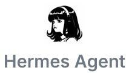
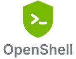
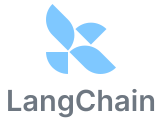
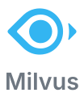
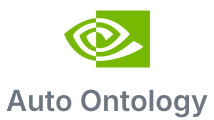
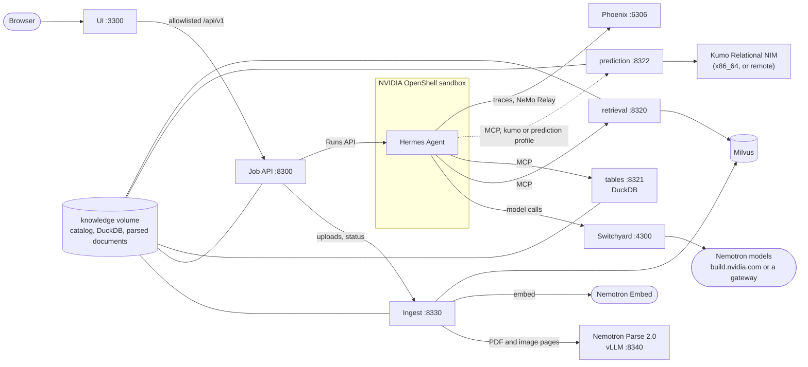

<!--
SPDX-FileCopyrightText: Copyright (c) 2026, NVIDIA CORPORATION & AFFILIATES. All rights reserved.
SPDX-License-Identifier: Apache-2.0
-->

# NVIDIA Knowledge Foundation

<p align="center">
  <a href="https://hermes-agent.nousresearch.com"></a>&nbsp;&nbsp;
  <a href="https://github.com/NVIDIA/OpenShell"></a>&nbsp;&nbsp;
  <a href="https://developer.nvidia.com/nemotron"></a>&nbsp;&nbsp;
  <a href="https://github.com/NVIDIA-NeMo/Switchyard"></a>&nbsp;&nbsp;
  <a href="https://kumo.ai"></a>&nbsp;&nbsp;
  <a href="https://github.com/langchain-ai/langchain-nvidia"></a>&nbsp;&nbsp;
  <a href="https://milvus.io"></a>&nbsp;&nbsp;
  <a href="https://phoenix.arize.com"></a>&nbsp;&nbsp;
  <a href="tools/auto-ontology/README.md"></a>
</p>

You ask a question about your enterprise knowledge and get an answer that cites the documents and tables behind
it. A Hermes agent in an OpenShell sandbox plans the work and calls tools: document retrieval with Nemotron
embedding and reranking over Milvus, read-only SQL over DuckDB, and per-entity predictions with NVIDIA Kumo. Every
model call goes through Switchyard, which holds the model keys. The UI draws the run as a live graph of every
model and tool call, links its trace in Phoenix, and replays recorded runs without keys or a GPU.

The knowledge comes from two places, picked with the selector in the top-right corner:

- **An industry.** Retail, Manufacturing, Healthcare or Financial Services: a fictional company's policies,
  procedures, reports, slide decks, scanned pages and operational tables, with featured questions and recorded
  answers ([data packs](docs/data-packs.md)). All of it is synthetic.
- **Your data.** Upload files and watch each one pass through the ingestion pipeline, stage by stage, then ask
  about them ([ingestion](docs/ingestion.md)):

| Files | Pipeline |
|---|---|
| PDF, scans and images (`.pdf .png .jpg .jpeg .tif .tiff .webp .bmp`) | docling with NVIDIA Nemotron Parse 2.0 on vLLM, then chunking and Nemotron Embed into Milvus |
| Office, HTML and text (`.docx .pptx .html .htm .md .txt`) | docling's own converters, then chunking and Nemotron Embed into Milvus |
| Tables (`.csv .tsv .xlsx .parquet .json .jsonl`) | DuckDB, then profiling (row counts, keys, time columns, foreign keys) for SQL and Kumo predictions |

Industry packs go through the same pipeline at startup, so an industry and your uploads are queried the same way.

## Architecture



The ingest service is the only writer of the knowledge volume; everything else reads it. Every port is published
on 127.0.0.1. [Architecture](docs/architecture.md) has the components, the request flow and the trust boundaries.

## Run it

You need Docker Engine 28+ with Compose 2.30+ on Linux with kernel 6.2+, bash, curl and an `nvapi-` key from
[build.nvidia.com](https://build.nvidia.com). The `parse` profile needs an NVIDIA GPU with the NVIDIA Container
Toolkit; the `kumo` profile also needs an x86_64 host. OpenShell 0.1.2 runs in containers that `demo.sh` pins
and builds, so there is no CLI to install.

```bash
git clone <this repository> knowledge-foundation && cd knowledge-foundation
./scripts/demo.sh init            # creates .env (mode 600) and its internal secrets
"${EDITOR:-vi}" .env              # set INFERENCE_API_KEY and COMPOSE_PROFILES (below)
./scripts/demo.sh doctor --keys   # checks the host, .env and every model id
./scripts/demo.sh up              # builds and starts everything; the packs ingest in the background
./scripts/demo.sh check           # proves the sandbox boundary
```

| Host | `COMPOSE_PROFILES` | What runs locally |
|---|---|---|
| DGX Spark (arm64, GB10) | `core,parse` (the default) | Everything but Kumo. For predictions, run the Kumo NIM on an x86_64 host and add `prediction` with `KUMO_RELATIONAL_URL` ([operations](docs/operations.md#dgx-spark-mode)) |
| Brev or any x86_64 GPU VM | `core,parse,kumo` | Everything, the Kumo Relational NIM included ([operations](docs/operations.md#brev-vm-mode)) |

The first `up` downloads Nemotron Parse 2.0 and builds every image. Then open:

| What | URL |
|---|---|
| The UI | <http://127.0.0.1:3300> (`UI_PORT`) |
| Phoenix traces | <http://127.0.0.1:6306> |

`./scripts/demo.sh status` shows the services, the sandbox and each pack's ingestion progress.
`./scripts/demo.sh replay` serves the recorded sessions alone, with no `.env`, keys or GPU. On a remote host, use
an SSH tunnel to those ports. [Configuration](docs/configuration.md) covers every variable.

## Documentation

- [Architecture](docs/architecture.md): components and ports, request flow, the knowledge catalog, trust
  boundaries, limitations
- [Ingestion](docs/ingestion.md): the pipeline per file kind, Nemotron Parse, chunking, embedding, DuckDB, the
  HTTP API, limits
- [Data packs](docs/data-packs.md): the pack format, the four industries, adding one, generators, recordings
- [Configuration](docs/configuration.md): every `.env` variable, profiles, hardware, `doctor`
- [Operations](docs/operations.md): lifecycle, Spark mode, Brev VM mode, Phoenix, on-demand checks,
  troubleshooting
- [Models and routing](docs/models-and-routing.md): endpoints, model ids, routing templates, the bake-offs
- [OpenShell](docs/openshell.md): the sandbox image, its policy, providers and lifecycle
- [Customize](docs/customize.md): wiring a tool, a server, a skill or a model
- [Development](docs/development.md): project layout, tests per project, Playwright, contracts
- [Decisions](docs/decisions.md): the decision log and its workarounds
- Components: [ingest](ingest/README.md), [API](api/README.md), [UI](ui/README.md), [agent](agent/README.md),
  [retrieval](tools/retrieval/README.md), [tables](tools/tables/README.md),
  [prediction](tools/prediction/README.md), [Auto Ontology](tools/auto-ontology/README.md),
  [contracts](contracts/README.md), [eval](eval/README.md)
- Industries: [Retail](data/packs/retail/README.md), [Manufacturing](data/packs/manufacturing/README.md),
  [Healthcare](data/packs/healthcare/README.md), [Financial Services](data/packs/financial-services/README.md)

This repository was converted from a market-analysis demo; the agent, sandbox, router, job API and UI keep that
demo's design ([decisions](docs/decisions.md)).

## License

Apache-2.0 ([LICENSE](LICENSE)). The UI is derived from the [AI-Q blueprint UI](https://github.com/NVIDIA-AI-Blueprints/aiq);
[`ui/UPSTREAM.md`](ui/UPSTREAM.md) records the changes. Each model and container image keeps its provider's
license and terms.
