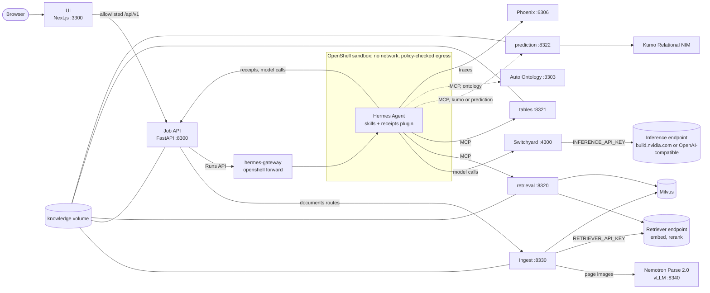
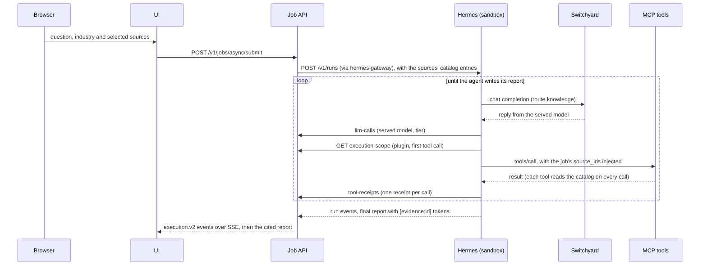

<!--
SPDX-FileCopyrightText: Copyright (c) 2026, NVIDIA CORPORATION & AFFILIATES. All rights reserved.
SPDX-License-Identifier: Apache-2.0
-->

# Architecture

One agent, four tools, an ingestion service and a web UI that shows every step. Hermes Agent runs inside an
OpenShell sandbox. It answers a question by calling MCP tools over the sources the user selected, and it cites
each tool result it relies on. Every model call leaves the sandbox through Switchyard, which holds the model key
and picks the model. The ingest service turns industry packs and uploads into one knowledge catalog that every
tool reads. The job API records each run as typed events and receipts, and the UI draws them as an execution
graph. Everything runs in one Docker Compose project, `knowledge-foundation`, driven by `scripts/demo.sh`.

## Components



Every port is published on 127.0.0.1 only (`UI_BIND_HOST` can open the UI's alone to a link that requires
sign-in, such as a Brev link: [operations](operations.md#brev-vm-mode)). The sandbox reaches the services as
`host.openshell.internal:<host port>`, which the host-networked OpenShell supervisor maps to the host's loopback.
The browser talks only to the UI, which proxies an allowlisted set of API routes.

The ports are a block of their own (3300, 4300, 6306, 83xx, 1838x), so the demo shares a host, such as a DGX
Spark, with other demos. `doctor` refuses to start when one of them is taken.

| Service | Profile | Host port (127.0.0.1) | Role | Code |
|---|---|---|---|---|
| `ui` | core, replay | 3300 (`UI_PORT`) | Next.js web app: the industry selector, uploads, the execution graph; proxies an allowlisted `/api/v1/*` to the API; serves the replay bundles | [`ui/`](../ui/README.md) |
| `api` | core | 8300 | FastAPI job service: the catalog, the queue, Hermes runs, `execution.v2` events, receipts, reports, the data viewer, voice transcription; forwards the documents routes to ingest | [`api/`](../api/README.md) |
| `switchyard` | core | 4300 | Model router; the only holder of the model keys on the agent path | [`infra/switchyard/`](../infra/switchyard/README.md) |
| `phoenix` | core | 6306 | Arize Phoenix: trace UI and OTLP/HTTP collector | [`infra/phoenix/serve.py`](../infra/phoenix/serve.py) |
| `openshell` | core | 18380 (gRPC/mTLS), 18381 (health) | OpenShell gateway with the Docker compute driver; creates the Hermes sandbox | [`infra/openshell/`](../infra/openshell/README.md) |
| `hermes-gateway` | core | – | `openshell forward service`: the API's way in to Hermes on `127.0.0.1:8642` inside the sandbox | [`infra/openshell/`](../infra/openshell/README.md) |
| Hermes sandbox | – | – | Hermes Agent 0.21.5 with its profile, skills and receipts plugin; created by `demo.sh`, not by Compose | [`agent/`](../agent/README.md) |
| `ingest` | core | 8330 | The only writer of the knowledge catalog: uploads and industry packs through docling, Nemotron Parse, Nemotron Embed, Milvus and DuckDB | [`ingest/`](../ingest/README.md) |
| `milvus` | core | – | CPU standalone Milvus 2.6 (embedded etcd, local storage): one collection behind the alias `knowledge` | [`tools/retrieval/milvus/`](../tools/retrieval/milvus) |
| `retrieval` | core | 8320 | `retrieve_evidence`: embed, search and rerank over the document sources | [`tools/retrieval/`](../tools/retrieval/README.md) |
| `tables` | core | 8321 | `query_tables`: one read-only SELECT over the structured sources' DuckDB files | [`tools/tables/`](../tools/tables/README.md) |
| `prediction` | kumo, prediction | 8322 | `predict`: per-entity PQL predictions with `kumo-relational-client` | [`tools/prediction/`](../tools/prediction/README.md) |
| `kumo-relational` | kumo | – | Kumo Relational NIM 1.0.1 (x86_64 and an NVIDIA GPU) | [`tools/prediction/`](../tools/prediction/README.md) |
| `parse` | parse | 8340 | vLLM 0.27.1 serving NVIDIA Nemotron Parse 2.0 (an NVIDIA GPU) | [`infra/parse/entrypoint.sh`](../infra/parse/entrypoint.sh) |
| `auto-ontology-*` | ontology | 3303 (`auto-ontology-mcp`) | NVIDIA Auto Ontology: `ask_question` over one structured source | [`tools/auto-ontology/`](../tools/auto-ontology/README.md) |

The `build` and `tools` profiles hold the agent image build and the OpenShell CLI, which `demo.sh` runs. Named
volumes: `knowledge`, `api-data`, `phoenix-data`, `milvus-data`, `switchyard-data`, `openshell-state`,
`openshell-client`, `parse-cache` (the Parse weights) and `auto-ontology-db`.

## How a question is answered



1. The UI submits the question with the selected source ids, which may come from one industry or from "Your
   data". The API checks them against the catalog, queues the job (one runs, four wait) and starts a Hermes run.
   The run's instructions carry each selected source's catalog entry: for a structured source, its DuckDB alias,
   tables, columns, keys and prediction templates, so the agent writes SQL and PQL without a schema tool. The
   run's toolsets are `skills` plus the MCP server of each selected capability family (Hermes patch 0002).
2. Hermes sends every model call to Switchyard as the route `knowledge`. Switchyard serves it with the model its
   template picks ([models and routing](models-and-routing.md)) and reports the served model.
3. The `execution-receipts` plugin fetches the job's execution scope from the API once, then injects the job's
   immutable `source_ids` into every data tool call. After each call it posts a typed receipt, and the result the
   model sees carries the receipt's `evidence_id`.
4. The agent cites receipts as `[evidence:<id>]`. When the run completes, the API waits briefly for any last
   receipts, turns the tokens into numbered citations with a Sources list, and stores the report. A document
   citation names its file and page (`"return-refund-policy.pdf, p. 3"`).
5. Every Hermes event, model call and receipt becomes one `execution.v2` event. The UI follows them over
   Server-Sent Events and draws the graph (Documents: Nemotron Parse, Embed, Milvus, Rerank; Tables: DuckDB;
   Prediction: Kumo), the timeline and one explorer per tool call.

### Tool result size

Hermes (v2026.9.24) saves an MCP tool result longer than 50,000 characters to a file the sandboxed agent cannot
read and gives the model a 1,500-character preview instead; when one turn's results together pass 200,000
characters, it does the same to the largest. So every tool keeps its result at most 30,000 characters as the
agent reads it:

| Tool | How its result stays under 30,000 characters |
|---|---|
| `retrieve_evidence` | At most 8 passages of at most 2,400 characters; a result still too long drops its lowest-ranked passages |
| `query_tables` | At most 200 rows and 100 columns, text cut at 2,000 characters, then its last rows dropped |
| `predict` | At most 25 rows |
| Any data tool, `ask_question` included | The `execution-receipts` plugin measures the final string and, past 30,000 characters, drops rows from the end of the longest list, then cuts the longest text, and says what it left out in `shortened_to_fit`. The receipt is built from the whole result |

Relay, bundled with Hermes, exports the agent's OpenInference spans to Phoenix (project `knowledge-foundation`).
Switchyard and the three tool servers export theirs to the same project, so a job's trace shows the agent's turns, the
router's decisions and the tools' steps together.

## The knowledge catalog

Every industry pack and the user's workspace are co-resident in one volume, `knowledge`. Switching industry
rebuilds nothing and restarts nothing, and the sandbox is never recreated for data: every tool schema is
data-independent. The volume is mounted read-write only in `ingest` and read-only everywhere else.

```text
/knowledge/
  catalog/packs/<pack_id>.json                    PackManifest (contracts/catalog/pack-manifest.schema.json)
  catalog/sources/<source_id>.json                SourceManifest (contracts/catalog/source-manifest.schema.json)
  sources/<source_id>/files/<file_id>             original bytes (uploads; pack files are copied in)
  sources/<source_id>/documents/<document_id>.md  docling Markdown export, for previews
  sources/<source_id>/chunks/<document_id>.jsonl  chunks with metadata
  sources/<source_id>/tables.duckdb               structured sources only
  ingest/ingest.sqlite3                           ingestion jobs, files and stage events
```

- **Sources.** Ids are namespaced: `<pack_id>.<name>` for packs (`retail.policies`) and `workspace.documents` /
  `workspace.tables` for uploads. A source is `kind: documents` (searched in the shared Milvus collection by its
  id) or `kind: structured` (one DuckDB file, addressed as `<alias>.<table>` with the alias the snake-cased id,
  `retail_sales`). Its `capabilities` are the tool families it grants: `unstructured_retrieval`, or
  `structured_retrieval` and `structured_prediction`. Its `status` is `ready`, `ingesting`, `empty` or `failed`;
  the tools serve a source while it is `ready` or `ingesting`.
- **Packs.** A PackManifest is an industry (`kind: industry`) or the workspace (`kind: workspace`, "Your data"):
  title, icon, disclaimer, source ids, questions, the picker's examples and a digest.
- **Writes** are validated against the contract and atomic (a temporary name, then `os.replace`). Readers read the
  manifests on every request and never cache them.

The API offers a source with its capabilities narrowed to the tools this stack runs (`AGENT_FEATURES`), and a
pack's questions whose sources and tool pills it can serve. [Ingestion](ingestion.md) describes how the catalog is
written; [data packs](data-packs.md) how an industry becomes one.

## Contracts

Services share JSON contracts only; no service imports another's Python code.

| Contract | Defined in | Shared by |
|---|---|---|
| Tool registry: one entry per MCP tool (server, family, label, explorer, receipt kind, pills) | `contracts/tool-registry.json` | API, agent plugin, UI, wiring tests |
| `execution.v2` events and the `ReceiptV2` union (by `artifactKind`) | Pydantic models in `api/src/demo_api/events/` and `receipts/`, exported to `contracts/schemas/` and `ui/src/generated/` by `scripts/gen-contracts.sh` | API, plugin tests, UI |
| Knowledge catalog: `SourceManifest`, `PackManifest` | `contracts/catalog/*.schema.json` (hand-written) | ingest (writes), API, retrieval, tables, prediction |
| Industry pack format (`pack.yaml`, `questions.yaml`, schema version 3) | `data/schemas/*.schema.json` | ingest, `scripts/validate_packs.py` |
| Documents API (AI-Q's, plus stage fields) | [`ingest/README.md`](../ingest/README.md#http-api-demo-ingest-serve-port-8330) | ingest, API, UI |
| Recordings bundle v2 (`index.json`, `pack.json`, `sessions/<id>.json`, `database.json`) | [`api/README.md`](../api/README.md#recordings) | `demo-api record`, the UI's replay mode |

[`contracts/README.md`](../contracts/README.md) describes the registry, the events, the receipts and the limits
the API enforces on them.

## Trust boundaries

The demo is a single-user local application. It has no user accounts, so everything it serves stays on the host's
loopback interface, unless `UI_BIND_HOST` opens the UI to a link that requires sign-in. Within that, the agent is
treated as untrusted: it reads documents, uploads and tool results that could carry prompt injections.

| Boundary | What enforces it |
|---|---|
| Host network | Every port is published on `127.0.0.1`, except the UI's when `UI_BIND_HOST` is set for a link that requires sign-in. That exposes the UI and its `/api/v1` proxy (job submit, uploads, the data viewer's query) with no sign-in of its own; `doctor` warns. Switchyard (no inbound authentication), Phoenix (trace payloads), ingest, Parse and the Auto Ontology MCP server (trusted service mode) stay on loopback whatever `UI_BIND_HOST` says. `demo.sh test compose` fails if any other port leaves loopback |
| Browser → API | The UI proxies only the packs, pack, data source, documents and job routes it uses. `/internal/**` and everything else is a 404. A path segment must match a strict pattern (no traversal). In replay mode the proxy calls nothing |
| Upload path | The API streams the multipart body to ingest and refuses one larger than `INGEST_MAX_REQUEST_MB` (413). Ingest accepts only allowlisted extensions, sniffs the content (a renamed file is refused), caps each file (`INGEST_MAX_FILE_MB`) and the files per request (`INGEST_MAX_FILES`), names stored files by content hash, and fails a bad file on its own. Uploaded documents are parsed by docling and Parse outside the sandbox; the agent sees only their chunks and tables, through the tools |
| Sandbox network | The sandbox has no network interface. The host-networked OpenShell supervisor makes every connection after checking the policy: each MCP endpoint allows the handshake and an explicit tool list, Switchyard allows chat completions and the model list, the API allows only the three `/internal/hermes` routes, and Phoenix allows only `POST /v1/traces`. Ingest and Parse are unreachable. Only Hermes' interpreter may connect |
| Sandbox filesystem | Landlock (a hard requirement): Hermes and the skills are read-only, `HERMES_HOME` and the workspace are writable. The Hermes tools exposed to runs are the skills toolset and the MCP data tools only: no terminal, file, browser or web tools |
| Tables SQL | `query_tables` checks the SQL with sqlglot: exactly one SELECT over the selected sources' `<alias>.<table>`, no other statement, no file or URL reads, no system functions. Then it runs in a separate worker process: an in-memory DuckDB with each source `ATTACH`ed `READ_ONLY`, `enable_external_access = false`, `autoload_known_extensions = false`, `lock_configuration = true`, 1 GB of memory, a 10 s kill and 200 rows. The two locks are independent: a query the guard misreads still cannot reach a file, change a setting or write |
| Prediction | The `predict` entity filter runs in the same kind of locked DuckDB; the graph is built read-only; one 60 s attempt against `KUMO_RELATIONAL_URL` |
| Secrets | No model key enters the sandbox: Switchyard holds `INFERENCE_API_KEY` and `CAPABLE_API_KEY`, ingest and retrieval `RETRIEVER_API_KEY` (by default the inference key), ingest `PARSE_API_KEY` (a hosted Parse endpoint only). The receipt key is an OpenShell placeholder that the supervisor replaces on the `/internal/hermes` routes only. Keys reach services as Compose secrets (files in `/run/secrets`), except Auto Ontology's and an optional hosted Kumo key, which upstream and the client read from the environment |
| Per-job scope | Each run gets only the toolsets of its selected sources and cannot widen them (patch 0002). The plugin injects the job's immutable `source_ids` into every data tool call, and the tools refuse other sources and source ids outside the contract's pattern |
| Skills | Skills are baked read-only. `skill_manage` writes are staged and never applied, so an injected document cannot plant a skill for a later job |
| Data viewer | `POST /v1/data_sources/{id}/query` runs one read-only SELECT in a separate process: 5 s, 100 rows, two at a time |

`./scripts/demo.sh check` proves the sandbox boundary on the running stack: the placeholder key, blocked egress,
the allowed and denied Switchyard and API routes, ingest and Parse unreachable, the tables server's non-MCP
routes denied, and the plugin's routes reachable. [OpenShell](openshell.md) has the details.

The UI has no sign-in and spends your inference credits: anyone who can open a link to it without sign-in can run
the agent and upload files on the keys in `.env`. `.env` is created with mode 600 and is gitignored, and `doctor`
never prints a key. A recorded bundle holds questions, answers, evidence excerpts and model names; review it
before committing ([data packs](data-packs.md#recordings)). To report a security issue, use
[NVIDIA's product security process](https://www.nvidia.com/en-us/security/) rather than a public issue.

## Limitations

- **Synthetic data.** Every industry's company, people, documents and figures are fictional, generated for a
  software demonstration.
- **Kumo is x86_64 only.** The Kumo Relational NIM ships for amd64. On a DGX Spark, predictions need a remote NIM
  (on an x86_64 host, reached as [operations](operations.md#kumo-through-a-remote-nim) describes) with the
  `prediction` profile; without one, `predict` answers `available: false` with the reason, and without the tool
  the API offers no prediction questions.
- **Parse needs a GPU or a key.** Without the `parse` profile or a hosted `PARSE_BASE_URL`, PDFs are read from
  their text layer (no layout, no scanned pages) and images are refused.
- **Auto Ontology is private.** The `ontology` profile needs access to the `NVIDIA/auto-ontology` submodule,
  which is not public yet; it serves one structured source (`AUTO_ONTOLOGY_SOURCE`). The demo needs none of it.
- **Reranking on an OpenAI-compatible gateway.** Some gateways serve a Cohere-style `/v1/rerank`, not NVIDIA's
  `/ranking`; with such a gateway set `RETRIEVER_RERANK_MODEL` empty, and hits keep their vector order.
- **Hosted models, with their terms.** The agent, embedding and rerank models are hosted (build.nvidia.com or a
  gateway), and each call is subject to that provider's terms. Only Parse and Kumo run locally.
- **One user.** There are no accounts and no authentication, and one job runs at a time. The demo is for one
  person on one host.

## Technologies

| Layer | Technology | Version |
|---|---|---|
| Agent | Hermes Agent | 0.21.5 (image `nousresearch/hermes-agent:v2026.9.24`) |
| Sandbox | NVIDIA OpenShell (gateway, supervisor, sandbox, CLI) | 0.1.2 |
| Model router | NVIDIA Switchyard (`switchyard-server`) | 0.3.0 |
| Models (default, build.nvidia.com) | Nemotron 3 Ultra 550B-A55B on every turn; Nemotron 3 Super 120B-A12B for auxiliary calls | hosted |
| Document parsing | docling (`docling-slim`, `nemotron_parse_v2` preset, API engine); NVIDIA Nemotron Parse 2.0 on vLLM | 2.132; vLLM 0.27.1 |
| Embedding, reranking | Nemotron 3 Embed 1B, Llama Nemotron Rerank VL 1B v2 through `langchain-nvidia-ai-endpoints` | hosted; 1.4.3 |
| Vector store | Milvus (CPU standalone), `pymilvus` | 2.6.25, 2.6.17+ |
| Tables | DuckDB, sqlglot | 1.5.5, 30 |
| Prediction | Kumo Relational NIM, `kumo-relational-client` | 1.0.1, 1.0.2 |
| Structured questions (optional) | NVIDIA Auto Ontology | 1.0.0 |
| Tool protocol | Model Context Protocol, Python SDK over streamable HTTP | `mcp` 2.2 |
| Tracing | NeMo Relay (bundled with Hermes), Arize Phoenix | Relay < 0.9, Phoenix 20.16.0 |
| Job API, ingest | Python, FastAPI, uvicorn, Pydantic, SQLite | 3.12 |
| UI | Next.js, React, NVIDIA KUI, Zustand, Tailwind CSS | 16.3.7, 18.3, 0.600, 5, 4 |
| Platform | Docker Engine, Docker Compose, uv, Node.js | 28+, 2.30+, 0.12, 22 |

Each keeps its own license, and each model its provider's terms.

## Design rules

- **One lifecycle script.** `scripts/demo.sh` orders the bring-up around the sandbox, which Compose does not
  manage. There is no Makefile.
- **Pinned and reproducible.** Runtime images are pinned by digest (the Parse model also by revision), the
  OpenShell release in one file (`infra/openshell/versions.env`), Python dependencies in one `uv.lock` per service
  (Python 3.12), and the UI in `package-lock.json`. A cached rebuild gives the same image ID, so a repeat `up`
  recreates nothing and keeps the sandbox.
- **A shared Docker host.** Every resource belongs to the Compose project `knowledge-foundation`, and sandboxes
  carry the OpenShell namespace label `knowledge-foundation`. `demo.sh` never removes resources it did not create
  and never runs `--remove-orphans`. It prunes only when asked ([disk](operations.md#disk)).
- **One writer.** Only ingest writes the knowledge volume; the API and the tools read it per request.
- **Contract first.** A tool is named once in the registry. Event and receipt types are generated from the API's
  models into the UI. `agent/tests/test_wiring.py` checks that every file naming a tool or an endpoint agrees.

Decisions and the workarounds they required are in [decisions](decisions.md).
