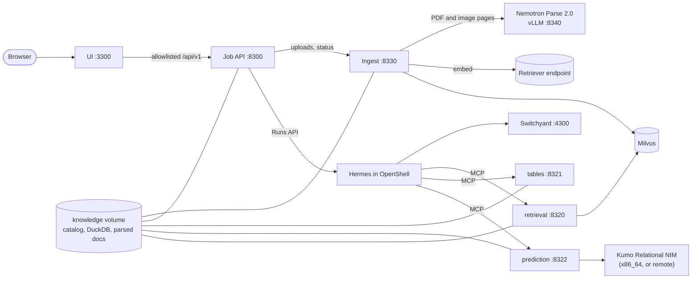

<!--
SPDX-FileCopyrightText: Copyright (c) 2026, NVIDIA CORPORATION & AFFILIATES. All rights reserved.
SPDX-License-Identifier: Apache-2.0
-->

# NVIDIA Knowledge Foundation: design

Status: approved for execution (the user asked for plan-then-execute without a review stop, 2026-10-02).
Base: `market-analysis-claw-demo` at `53075c9`, imported wholesale as this repository's first commit.

## 1. Intent

A demo in which anyone can query their enterprise knowledge, with cited answers and a visible execution graph.

- **What the user said.** Knowledge can be structured (Excel, CSV) or unstructured (any document). It is ingested by
  a robust pipeline written by us, in the spirit of AI-Q's, using Nemotron Parse and Kumo's structured-table model,
  on a standard foundation (docling, LangChain, LlamaIndex, or whatever fits). There are two modes:
  1. **Your data**: upload anything, watch it ingest, ask questions.
  2. **Industry**: a dropdown in the top-right corner picks an industry; its data sources are already there, with
     pre-written and pre-recorded questions, as in the market demo. Several industries.
- Market tools go. Everything follows the libraries' documented practice; nothing custom where a library does it.
- Hosting is unchanged in kind: one Docker Compose project driven by `scripts/demo.sh`. Everything (DuckDB, Milvus,
  the Parse model, Kumo) is meant to run on a DGX Spark, and the same stack runs on a Brev x86_64 GPU VM.
- E2E and Playwright tests over all of it.

**Success**: on this Spark, `./scripts/demo.sh up` brings the stack up; in Chrome the user picks an industry, asks
a featured question and gets a cited answer drawn from documents parsed by Nemotron Parse and tables in DuckDB;
switches to "Your data", uploads a PDF and a spreadsheet, watches each pass through the pipeline stages, and asks a
question that cites both. Replay works with no keys. Unit, contract, Playwright and live E2E suites pass.

## 2. What stays from the base

Everything generic keeps its design and its documented workarounds (`docs/decisions.md`):

- Hermes Agent 0.21.5 (image pinned by digest) with its four patches, in an OpenShell 0.1.2 sandbox; the
  `execution-receipts` plugin (scope injection, receipts, `evidence_id`, the 30,000-character result cap).
- Switchyard 0.3.0 as the only holder of model keys; Phoenix tracing through NeMo Relay.
- The FastAPI job API (asyncio runner on SQLite, `execution.v2` events, receipts that fail closed, cited reports).
- Contracts first: `contracts/tool-registry.json`, Pydantic models exported by `scripts/gen-contracts.sh` into JSON
  Schema and TypeScript; `agent/tests/test_wiring.py` keeps every file that names a tool in agreement.
- The AI-Q-derived Next.js UI (KUI, Zustand), its execution graph, explorers, data viewer and replay mode.
- Retrieval on `langchain-nvidia-ai-endpoints` (embed and rerank clients) and plain `pymilvus` on Milvus 2.6.
- Auto Ontology as an optional profile (blocked today: the private submodule needs SSO-authorized access).

## 3. What goes

Market analytics (`tools/market-analytics/`, its seven tools, its skill, explorers, graph nodes, the CPU/GPU
Benchmark tab, `analytics`/`analytics-gpu` profiles, the GPU parity and perf checks), the two market packs, the
market importer and SEC/eCFR/GDELT corpus builders, NeMo Data Designer's market generator, the market eval
oracles and check kinds, and the market copy everywhere. Names: `market-demo` → `knowledge-foundation`,
`market-research*` routes → `knowledge*`, Phoenix project `market-analysis-agent` → `knowledge-foundation`.

## 4. Architecture



### 4.1 The knowledge catalog (replaces the single active pack)

Every industry pack and the user's workspace are **co-resident**. Nothing is rebuilt or restarted to switch
industry, and the sandbox is never recreated for data: every tool schema is data-independent.

The `knowledge` volume, mounted read-write only in `ingest` and read-only everywhere else:

```text
/knowledge/
  catalog/packs/<pack_id>.json         pack manifest (PackManifest)
  catalog/sources/<source_id>.json     source manifest (SourceManifest)
  sources/<source_id>/files/<file_id>  original bytes (uploads; pack files are copied in)
  sources/<source_id>/documents/<document_id>.md      docling markdown export, for previews
  sources/<source_id>/chunks/<document_id>.jsonl      chunks with metadata, for re-embedding without re-parsing
  sources/<source_id>/tables.duckdb   structured sources only
  ingest/ingest.sqlite3                ingestion jobs, files and stage events
```

Writes are atomic (write to a temporary name, `os.replace`). Readers read the manifests on every request.

Source ids are namespaced: `<pack_id>.<name>` for packs (`retail.policies`) and `workspace.documents` /
`workspace.tables` for uploads. They satisfy the UI proxy's segment pattern and the contracts' `OpenIdentifier`.

**SourceManifest** (JSON, `schema_version: "1"`), shared contract `contracts/schemas/source-manifest.schema.json`:

| Field | Meaning |
|---|---|
| `id`, `pack_id` (`null` for the workspace), `name`, `description`, `agent_description` | identity and copy |
| `kind` | `documents` or `structured` |
| `capabilities` | tool families it grants: `unstructured_retrieval`; `structured_retrieval`, `structured_prediction` |
| `synthetic`, `default_enabled`, `example_questions` | as before |
| `status` | `ready`, `ingesting`, `empty`, `failed` |
| `updated_at` | ISO 8601 UTC |
| `documents` | documents kind: `{count, chunks, collection, embed_model}` |
| `database` | structured kind: `{path, alias, tables: [TableInfo]}`; `path` is relative to `/knowledge` |
| `prediction` | optional: `{templates: [{id, name, description, pql}]}` |

`TableInfo`: `name`, `description`, `row_count`, `primary_key` (or null), `time_column` (or null),
`columns: [{name, type, description, nullable}]`, `foreign_keys: [{column, references_table, references_column}]`.
The DuckDB `alias` is the snake-case source id (`retail_sales`); agents address tables as `<alias>.<table>`.

**PackManifest**: `id`, `kind` (`industry` or `workspace`), `title`, `description`, `icon`, `version`, `as_of`,
`disclaimer`, `sources` (ids), `questions`, `examples`, `conversations` (the shapes of today's `PackView`), `digest`,
`status` (`ready`, `ingesting`, `failed`).

### 4.2 Ingestion service (`ingest/`, new)

A FastAPI service with its own `uv` project (Python 3.12), on `127.0.0.1:8330`, the only writer of the catalog.

**Pipeline per file**, each stage recorded with progress so the UI can draw it:

| Kind | Stages |
|---|---|
| Document (`.pdf .png .jpg .jpeg .tif .tiff .webp .bmp`) | `received` → `detected` → `parsing` (page i of n) → `chunking` → `embedding` (k of n) → `indexing` → `ready` |
| Document (`.docx .pptx .html .htm .md .txt`) | `received` → `detected` → `converting` → `chunking` → `embedding` → `indexing` → `ready` |
| Table (`.csv .tsv .xlsx .xls .parquet .json .jsonl`) | `received` → `detected` → `loading` (sheet i of n) → `profiling` → `ready` |

Any stage can end in `failed` with an error code and message; a failed file never blocks the others.

- **Detection**: extension allowlist, then content sniffing with `filetype` (docling's own dependency) so a renamed
  file is refused; size and count limits (`INGEST_MAX_FILE_MB` 100, `INGEST_MAX_FILES` 20 per request); sha256
  dedup within a source (re-uploading identical bytes returns the existing file).
- **Documents: docling.** One `DocumentConverter`:
  - PDF and images use docling's `VlmPipeline` with its official **`nemotron_parse_v2`** preset
    (`ResponseFormat.NEMOTRON_PARSE_V2`, which docling turns into a `DoclingDocument` with layout classes, tables and
    reading order), run through docling's **API engine** against the local vLLM server that serves
    `nvidia/NVIDIA-Nemotron-Parse-2.0` as its model card prescribes. The request params are the model card's:
    `skip_special_tokens: false`, `top_k: 1`, `repetition_penalty: 1.1`, `temperature: 0`, `max_tokens: 9000`.
  - DOCX, PPTX, HTML, Markdown and text use docling's own format backends (born-digital: exact text, no model).
  - With no Parse endpoint configured or reachable, a PDF falls back to docling's `pypdfium2` text layer with no
    model, and the file records `parser: "pdf-text-layer"` plus a warning; the UI shows it. Images then fail with
    `parser_unavailable`.
- **Chunking**: docling's `HybridChunker` (docling-core `chunking` extra), the documented docling RAG practice;
  each chunk is embedded as `chunker.contextualize(chunk)` (heading path + text). Metadata per chunk: `page_start`,
  `page_end`, `headings`, `doc_items` labels, `parser`, and a `citation` string (`"<file name>, p. 3"`).
- **Embedding**: `NVIDIAEmbeddings` from `langchain-nvidia-ai-endpoints` (passage input type, explicit `base_url`
  and key, batches of 50 with retries), the same client and pins as `tools/retrieval`.
- **Index**: one Milvus collection, alias `knowledge`, schema of `tools/retrieval/src/demo_retrieval/store.py`
  (`source_id` partition key, HNSW/COSINE). Ingest creates it if missing, deletes a document's chunks by
  `document_id` before inserting its new ones, and records the embed model in each SourceManifest; a different embed
  model triggers a re-embed from the stored chunk files.
- **Tables: DuckDB.** One `tables.duckdb` per structured source. CSV/TSV with `read_csv` (auto-detection),
  Excel with the `excel` extension's `read_xlsx` (one table per sheet; extension installed at image build time),
  Parquet with `read_parquet`, JSON with `read_json_auto`. Table names are snake-cased `<file stem>[_<sheet>]`,
  deduplicated. **Profiling** fills `TableInfo`: row counts, column types, a primary key (a single unique, non-null
  column, preferring `*_id`/`id`), time columns (DATE/TIMESTAMP), and foreign keys (a column whose non-null values
  are all contained in another table's primary key, names agreeing). Pack sources may declare keys explicitly in
  `pack.yaml`; declared keys win.
- **Robustness**: SQLite (WAL) job store; a worker pool (`INGEST_WORKERS`, default 2) pulling files in order;
  restart recovery re-queues unfinished files (each stage is idempotent: delete-then-insert); per-stage timeouts;
  the Parse client retries transient errors (docling's API engine, plus tenacity on embedding); originals are kept
  so any file can be re-ingested.

**HTTP API** (AI-Q's documents contract, so its upload UI can be restored nearly verbatim):

| Route | Purpose |
|---|---|
| `GET /health` | liveness; `ready` once the catalog is writable and Milvus answers |
| `GET /v1/collections`, `POST /v1/collections`, `GET`/`DELETE /v1/collections/{name}` | collections (`workspace` is the upload collection) |
| `POST /v1/collections/{name}/documents` | multipart `files` → `{job_id, file_ids, message}` |
| `GET /v1/collections/{name}/documents` | `{files: [FileInfo]}` |
| `DELETE /v1/collections/{name}/documents` | body `{file_ids}` |
| `GET /v1/documents/{job_id}/status` | `IngestionJobStatus` |
| `POST /v1/packs/sync` | ingest every pack under `/packs` whose digest changed (idempotent) |
| `GET /v1/packs/status` | per-pack sync status |

`FileProgress` and `FileInfo` gain optional fields, ignored by upstream's zod schemas: `kind` (`document` or
`table`), `stage`, `stage_detail` (for example `page 3 of 12`), `parser`, `tables` (names), `warnings`.

### 4.3 Industry packs (`data/packs/<id>/`)

A pack is raw files plus metadata, ingested by the same pipeline as an upload:

```text
data/packs/<id>/
  pack.yaml          identity, licenses, provenance, sources (each: kind, files globs, capabilities, descriptions,
                     optional declared keys and prediction templates)
  questions.yaml     questions (with tool pills), examples (picker order, at most 12), conversations
  files/             committed synthetic files: PDFs (some scanned, as images), DOCX, PPTX, PNG, CSV, XLSX
  generator/         the seeded script and the authored text that produced files/ (reproducible)
  recordings/        replay bundle v2 (index.json, pack.json, sessions/, database.json), written by `record`
  README.md          data card
```

`data/schemas/pack.schema.json` and `questions.schema.json` are rewritten for this (schema version `"3"`).

Industries (four now, one directory each to add more): **Retail**, **Manufacturing**, **Healthcare**,
**Financial Services** (retail banking, not markets). Each has 4 to 6 related tables with keys and timestamps (so
Kumo can predict something meaningful: churn, failure, readmission, default), 5 to 8 documents (policies, SOPs,
reports with tables, a slide deck, at least one scanned page so Parse's value is visible), 8 to 10 questions
spanning documents, SQL, both, and prediction. All data is synthetic and labeled so.

### 4.4 Tools (MCP servers)

All read the catalog per call; none has a data-dependent schema; every tool is `read_only_hint=True`; results stay
under 30,000 characters; `source_ids` is injected by the plugin and never chosen by the model.

| Server | Tool | Family | Receipt | Notes |
|---|---|---|---|---|
| `retrieval` :8320 | `retrieve_evidence(query, top_k, source_ids)` | `unstructured_retrieval` | `retrieval_evidence` | as today, over the shared `knowledge` collection; rerank optional (skipped when no rerank model is configured, recorded in the result) |
| `tables` :8321 (new) | `query_tables(question, sql, source_ids)` | `structured_retrieval` | `structured_query` | DuckDB in memory, each selected structured source `ATTACH`ed `READ_ONLY` under its alias, then `enable_external_access=false` and `lock_configuration=true`; one SELECT validated with sqlglot (the API's data-viewer rules); 10 s timeout via `interrupt()`; 200 rows |
| `prediction` :8322 (new) | `predict(question, pql, source_ids, anchor_time?)` | `structured_prediction` | `structured_prediction` (generalized to entity predictions) | `kumo-relational-client` against `KUMO_RELATIONAL_URL`; graph from the source's DuckDB with its TableInfo keys and links; one attempt, 60 s; without an endpoint the result is `available: false` with the reason |
| `auto_ontology` :3303 | `ask_question(question)` | `structured_retrieval` | `structured_query` | optional `ontology` profile, unchanged apart from names |

The run instructions (the source catalog the API sends to Hermes) carry, for each structured source, its alias,
tables, columns, keys and prediction templates (capped), so the agent writes SQL and PQL without a schema tool.

Skills: `searching-documents` (generalized), `querying-tables` (new), `predicting-with-kumo` (PQL over the
catalog's graph, with templates when a pack has them), `querying-auto-ontology` (optional). `SOUL.md` becomes an
enterprise-knowledge assistant with the same workflow, evidence and citation rules.

### 4.5 API changes

- `ActivePack` → `KnowledgeCatalog` (reads `/knowledge/catalog`).
- `GET /v1/packs` → `[{id, kind, title, description, icon, status}]`; `GET /v1/pack?id=` → `PackView` for that pack;
  `GET /v1/data_sources?pack=` → that pack's sources; the data viewer routes work per structured source.
- Job submit accepts namespaced source ids from any pack; the stored request carries `pack_id` and the catalog.
- The documents routes of 4.2 are forwarded to `ingest` (streaming the multipart body, `INGEST_MAX_REQUEST_MB`).
- The market benchmark routes and `MARKET_ANALYTICS_URL` go.

### 4.6 UI changes

- Product name **NVIDIA Knowledge Foundation**; landing page rewritten around "your knowledge, cited".
- **Industry selector** in the AppBar's right-hand group (KUI `Select`, like the composer's picker), also on the
  landing header: the industries plus **Your data**. The choice is a URL parameter (`?pack=`) and a cookie, so the
  server-rendered picker and landing questions follow it; switching starts a new session draft.
- **Your data** restores AI-Q's documents feature from upstream `bf4e67d1`: Data Sources gets "Connections | Files";
  the Files tab has the KUI `Upload` zone, file cards, delete confirmation; the composer gets the paperclip, the
  drag-and-drop overlay and the file counter; the pending-files banner. File cards show the pipeline stage, a
  progress bar, the parser used and warnings. Polling as upstream (interval 1.5 s while active).
- Execution graph: market nodes go; Documents (Nemotron Parse → Embed → Milvus → Rerank), Tables (DuckDB) and
  Prediction (Kumo) nodes stay or are added. Replay per pack: `/api/recordings/<pack>/...`.

### 4.7 Compose, profiles, ports, hosting

Ports move to a block that collides with nothing else on the shared Spark (port 6006 is held by another demo):

| Service | Port | Profile |
|---|---|---|
| ui | 3300 | core, replay |
| api | 8300 | core |
| switchyard | 4300 | core |
| phoenix | 6306 | core |
| openshell gateway | 18380, 18381 | core |
| retrieval, tables | 8320, 8321 | core |
| prediction | 8322 | kumo |
| ingest | 8330 | core |
| parse (vLLM, Nemotron Parse 2.0) | 8340 | parse |
| auto-ontology-mcp | 3303 | ontology |

- `core` now includes Milvus, ingest, retrieval and tables (documents and tables are the product).
- `parse`: `vllm/vllm-openai:v0.27.1` (multi-arch, already used on this Spark) serving Nemotron Parse 2.0 with the
  model card's `vllm serve` flags; weights in a named HF cache volume, downloaded on first start.
- `kumo`: the Kumo NIM (x86_64 only) plus the `prediction` server; or set `KUMO_RELATIONAL_URL` to a remote NIM
  (for the Spark: a Brev x86_64 VM through an SSH tunnel) and the `prediction` server runs without the local NIM.
- Spark default: `COMPOSE_PROFILES=core,parse`. Brev default: `core,parse,kumo`.
- Models stay hosted (agent, embed, rerank) on build.nvidia.com or any OpenAI-compatible gateway; only Parse and Kumo
  run locally.

## 5. Testing

| Layer | What |
|---|---|
| Unit (pytest per project) | ingest pipeline with a fake Parse server returning recorded Parse 2.0 output, a fake embedder and Milvus Lite; table loading and profiling on fixture CSV/XLSX; tables tool guards; prediction tool with a stub Kumo client; catalog, packs and forwarding in the API; plugin and wiring tests |
| Contracts | `scripts/gen-contracts.sh --check`; source/pack manifests validated against their schemas |
| UI (vitest) | industry selector, files tab, upload store and orchestrator, pipeline stage rendering |
| Playwright smoke (fake API) | industry switch changes picker, sources and URL; upload → stages → available → question; replay of every recorded session of every pack |
| Live E2E (`demo.sh test live`) | featured questions of each industry, and an upload-then-ask flow, against the running stack |
| Ops | `demo.sh doctor`, `demo.sh check` (sandbox boundary) |

## 6. Risks and blockers known now

1. **Kumo on the Spark**: the Kumo Relational NIM ships amd64 only. Predictions on the Spark need a remote NIM
   (Brev) until an arm64 build exists; the tool says so instead of failing silently.
2. **Auto Ontology**: the private submodule needs the `gh` token SSO-authorized for the NVIDIA org.
3. **Reranker on the internal gateway**: it serves a Cohere-style `/v1/rerank`, not NVIDIA's `/ranking`, so with
   that gateway reranking is off; build.nvidia.com keys keep it on.
4. **Nemotron Parse on GB10 with vLLM 0.27.1**: proven by a spike on this Spark (2026-10-02). Without the model
   card's runtime patch (`vllm_tied_patch/sitecustomize.py` on `PYTHONPATH`) vLLM leaves the output head untied and
   the model emits `<s>` until `max_tokens`; with it, docling's `nemotron_parse_v2` preset through the API engine
   (`PyPdfiumDocumentBackend`, `max_tokens: 8192` since the served context is 9,000) parsed a two-page PDF with a
   table in 2.3 s and a scanned page in 1.8 s, tables included (docling's `format-latex` extra converts Parse's
   LaTeX tables). The `parse` service pins the model revision (`b6742064f4a8cf22a10383ece5e7fbead355ac04`) and
   fetches the patch from that revision, as the card prescribes.

## 7. Library choices (researched 2026-10-02)

| Concern | Choice | Why |
|---|---|---|
| Conversion, chunking | `docling-slim` 2.132 extras `format-pdf-pypdfium2, format-office, format-html, format-markdown, format-latex, feat-chunking, convert-core` (no torch) | Official Nemotron Parse 2.0 preset; native office/HTML backends; `HybridChunker` is docling's RAG practice; arm64 |
| Parse serving | `vllm/vllm-openai:v0.27.1` (multi-arch, already on this Spark) + the card's patch | The Parse NIM has no GB10 profile; vLLM is the card's path |
| Hosted Parse (no GPU) | `nvidia/nemotron-parse-2.0` at `integrate.api.nvidia.com` (same chat contract) | Lets a GPU-less host still parse with a build.nvidia.com key |
| Chunk tokenizer | the embed model's Hugging Face tokenizer, baked into the ingest image | docling: align `HybridChunker`'s tokenizer with the embedder |
| Embeddings, rerank | `langchain-nvidia-ai-endpoints` 1.4.3, as `tools/retrieval` | decision 5 |
| Vector store | Milvus 2.6.25 (multi-arch) via `pymilvus` | unchanged |
| Tables | DuckDB 1.5.5 `read_csv`, `read_xlsx` per sheet (sheets listed with openpyxl), read-only locked connections for the agent | DuckDB's documented readers and securing guide |
| Prediction | `kumo-relational-client[relational,duckdb]` 1.0.2, `Graph.from_duckdb` + explicit keys + `graph.validate()` | The SDK the NIM serves; aarch64 wheels exist; the legacy `kumoai` SDK has none |
| Rejected | NeMo Retriever Library in-process (Ray, LanceDB default, unvalidated on Spark); LlamaIndex (decision 5) | Heavier than the demo needs |
